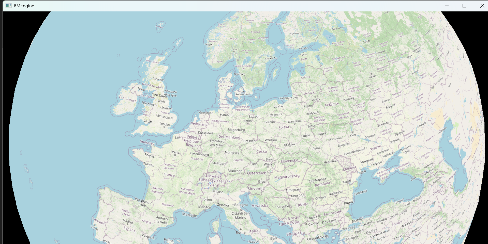

# BMEngine

BMEngine is a custom engine written for educational purposes.  
The main goal is to learn the Vulkan API.

## Coding Standards
- **Simplicity**  
- **Component independence**  
- **Non-pessimization**  
- **Minimal use of libraries**  
  *(Non-custom libraries will be replaced after the renderer component is written.)*

## Platform and Language Support
- **Supported Platform**: Windows  
- **Development Environment**: Visual Studio  
- **Shading Language**: GLSL  

## Features
- Simple mesh drawing  
- Phong shading source  
- Basic 2D shadows for directional light  

## Priority Tasks
1. Simplify the interface to Vulkan.  
2. Design the rendering system.  
3. Move data from the code to configuration files.

